<div align="center">

# 🏗️ High Availability Web Architecture on AWS

### A production-grade, highly available web infrastructure built on AWS
#### Designed for Scalability · Security · Fault Tolerance

<br/>


<br/>

---

### 🚀 Built With

| Service | Purpose | Type |
|:---:|:---:|:---:|
|  | Private Network | Networking |
|  | Application Layer | Compute |
|  | Load Balancing | Networking |
|  | High Availability | Compute |
|  | Data Layer | Database |
|  | Alerts & Metrics | Monitoring |

</div>

---

## 📐 Architecture Overview
```
┌─────────────────────────────────────────────────────────────┐
│                        🌐  Internet                         │
└──────────────────────────────┬──────────────────────────────┘
                               │
┌──────────────────────────────▼──────────────────────────────┐
│                ⚖️  Application Load Balancer                │
│                  (Internet-facing · HTTP:80)                 │
│            public-subnet-1    │    public-subnet-2           │
└───────────────┬───────────────────────────────┬─────────────┘
                │                               │
┌───────────────▼─────────────┐   ┌─────────────▼────────────┐
│      🖥️  EC2 Instance 1     │   │     🖥️  EC2 Instance 2   │
│        (ap-south-1a)        │   │       (ap-south-1b)       │
│       private-subnet-1      │   │      private-subnet-2     │
└───────────────┬─────────────┘   └─────────────┬────────────┘
                │                               │
                └───────────────┬───────────────┘
                                │
┌───────────────────────────────▼─────────────────────────────┐
│                    📈  Auto Scaling Group                   │
│               Min : 1  │  Desired : 1  │  Max : 2           │
└──────────────────────────────┬──────────────────────────────┘
                               │
┌──────────────────────────────▼──────────────────────────────┐
│                       🔀  NAT Gateway                       │
│                      (public-subnet-1)                      │
└──────────────────────────────┬──────────────────────────────┘
                               │
┌──────────────────────────────▼──────────────────────────────┐
│                  🗄️  RDS MySQL  (Single-AZ)                 │
│                    private subnet · ha-db                   │
└─────────────────────────────────────────────────────────────┘
```


---
## 🚀 Services Used

| Service | Purpose |
|---|---|
| **VPC** | Isolated network with public & private subnets |
| **EC2 (t2.micro)** | Web servers in private subnets |
| **Application Load Balancer** | Distributes traffic across EC2 instances |
| **Auto Scaling Group** | Automatically scales EC2 based on CPU load |
| **NAT Gateway** | Allows private EC2 to access internet securely |
| **RDS MySQL** | Managed relational database in private subnet |
| **CloudWatch** | Monitoring and CPU alarm (>70% threshold) |
| **Security Groups** | Firewall rules for each layer |
| **Bastion Host** | Secure SSH access to private instances |

---

## 🔒 Security Design

| Layer | Security Measure |
|---|---|
| ALB | Open to internet (HTTP:80) |
| EC2 | Only accessible from ALB security group |
| EC2 SSH | Only accessible from Bastion security group |
| RDS | Only accessible from EC2 security group (port 3306) |
| Private Subnets | No direct internet access |

---

## 🌐 Network Design

### VPC CIDR: `10.0.0.0/16`

| Subnet | Type | AZ | CIDR |
|---|---|---|---|
| public-subnet-1 | Public | ap-south-1a | 10.0.1.0/24 |
| public-subnet-2 | Public | ap-south-1b | 10.0.2.0/24 |
| private-subnet-1 | Private | ap-south-1a | 10.0.3.0/24 |
| private-subnet-2 | Private | ap-south-1b | 10.0.4.0/24 |

---

## ⚙️ Auto Scaling Configuration

```
Desired Capacity : 2
Minimum          : 1
Maximum          : 2
Scaling Policy   : Target Tracking (CPU > 50%)
Health Check     : ELB Health Check
```

---

## 📦 EC2 User Data Script

Every EC2 instance launched by ASG automatically runs this script:

```bash
#!/bin/bash
dnf update -y
dnf install httpd -y
systemctl start httpd
systemctl enable httpd
echo "Hello from $(hostname)" > /var/www/html/index.html
```

---

## 📸 Screenshots

<table>
  <tr>
    <td align="center">
      <b>🌐 VPC Created</b><br/><br/>
      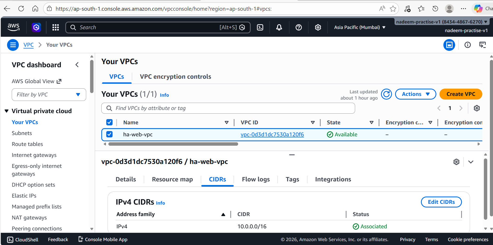
    </td>
  </tr>
  <tr>
    <td align="center">
      <b>🌐 VPC Overview</b><br/><br/>
      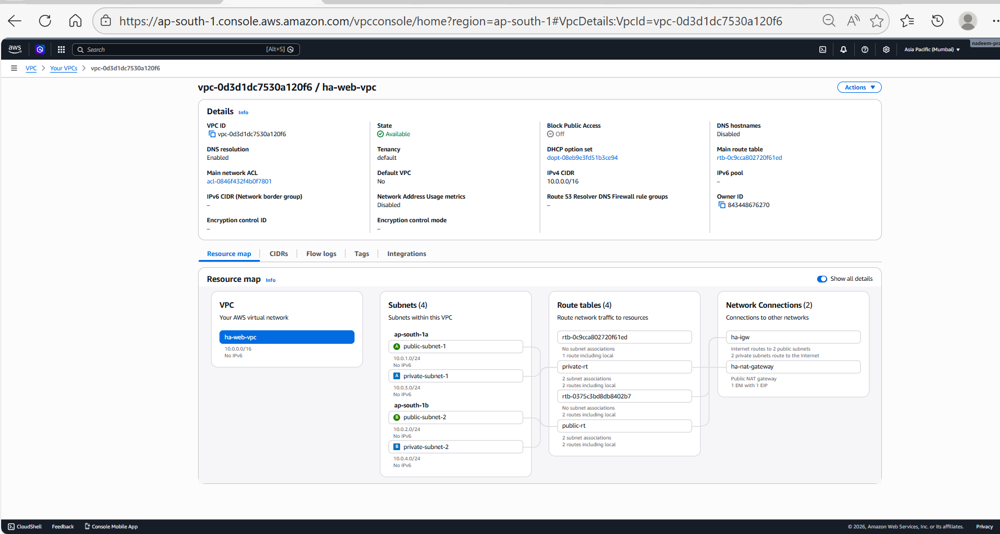
    </td>
  </tr>
  <tr>
    <td align="center">
      <b>🔀 Subnets (Public + Private across 2 AZs)</b><br/><br/>
      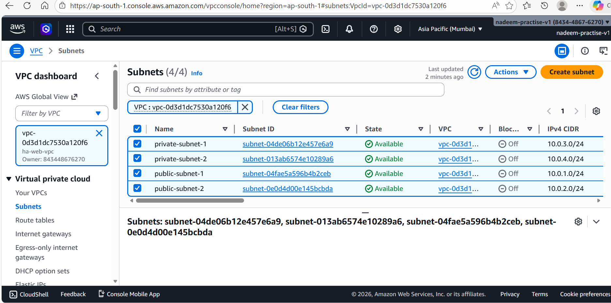
    </td>
  </tr>
  <tr>
    <td align="center">
      <b>🌍 Internet Gateway</b><br/><br/>
      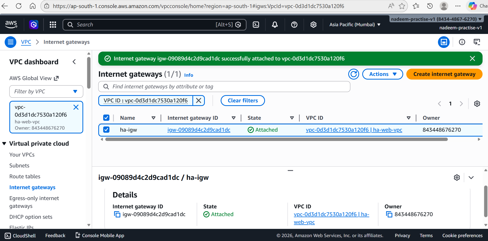
    </td>
  </tr>
  <tr>
    <td align="center">
      <b>🗺️ Route Tables Public</b><br/><br/>
      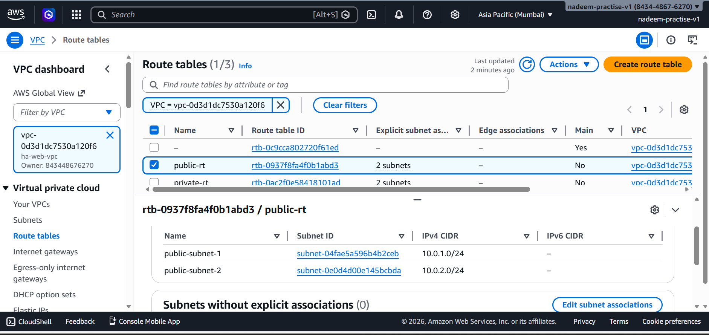
    </td>
  </tr>
  <tr>
    <td align="center">
      <b>🗺️ Route Tables Private</b><br/><br/>
      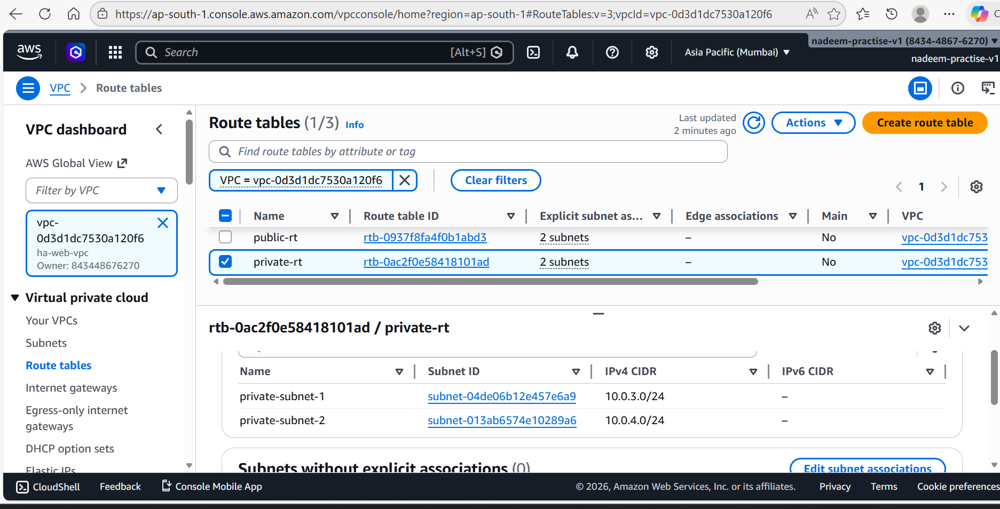
    </td>
  </tr>
  <tr>
    <td align="center">
      <b>🔒 Security Groups for ALB</b><br/><br/>
      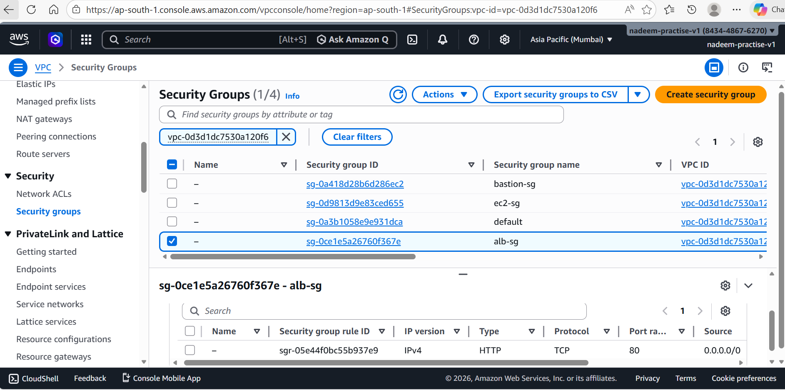
    </td>
  </tr>
  <tr>
    <td align="center">
      <b>🔒 Security Groups for Baston Host EC2</b><br/><br/>
      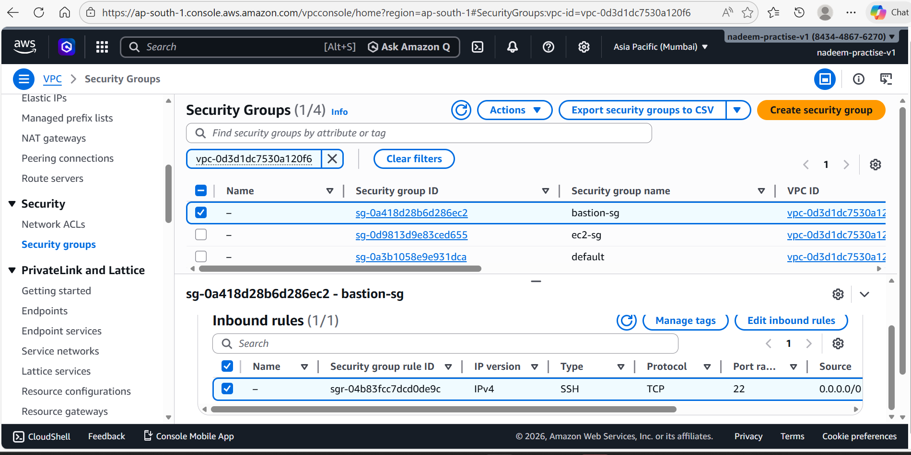
    </td>
  </tr>
  <tr>
    <td align="center">
      <b>🔒 Security Groups for Private EC2</b><br/><br/>
      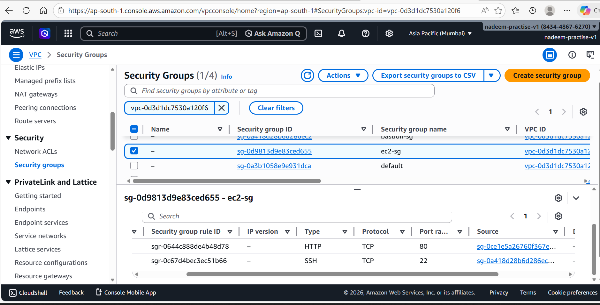
    </td>
  </tr>
  <tr>
    <td align="center">
      <b>🖥️ Bastion Host</b><br/><br/>
      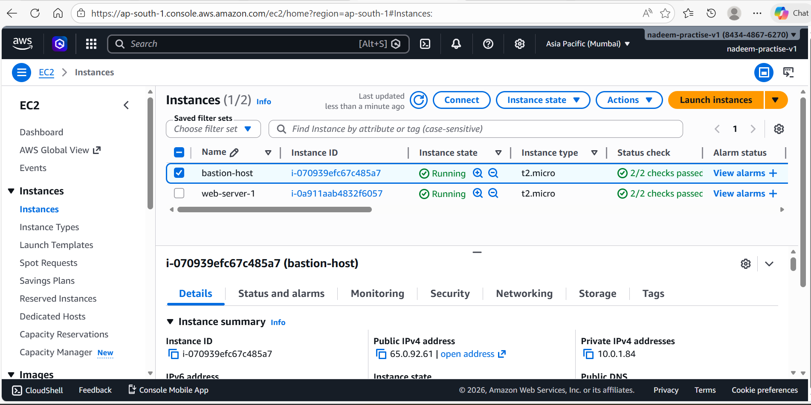
    </td>
  </tr>
  <tr>
    <td align="center">
      <b>🔐 Private EC2 (No Public IP)</b><br/><br/>
      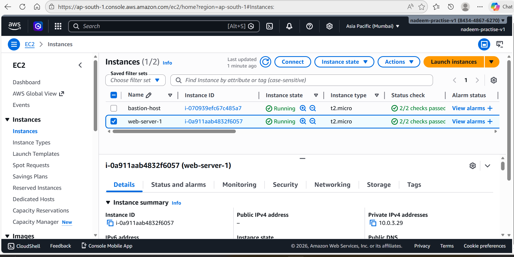
    </td>
  </tr>
  <tr>
    <td align="center">
      <b>🎯 Target Group</b><br/><br/>
      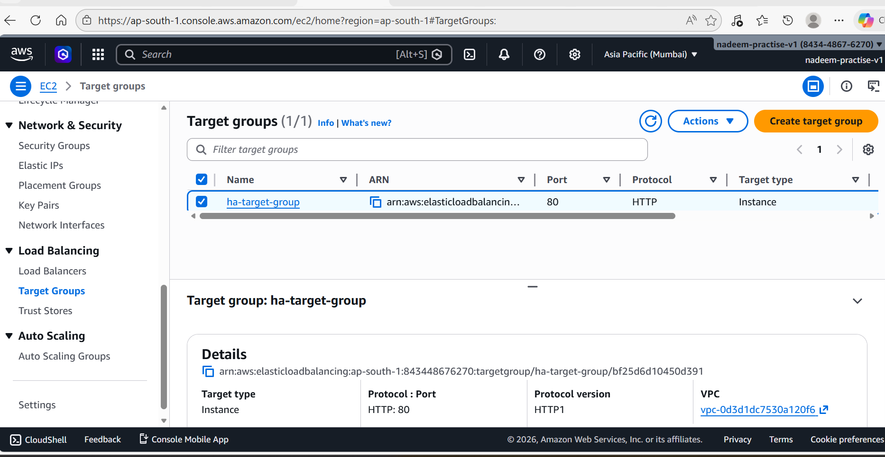
    </td>
  </tr>
  <tr>
    <td align="center">
      <b>⚖️ Application Load Balancer</b><br/><br/>
      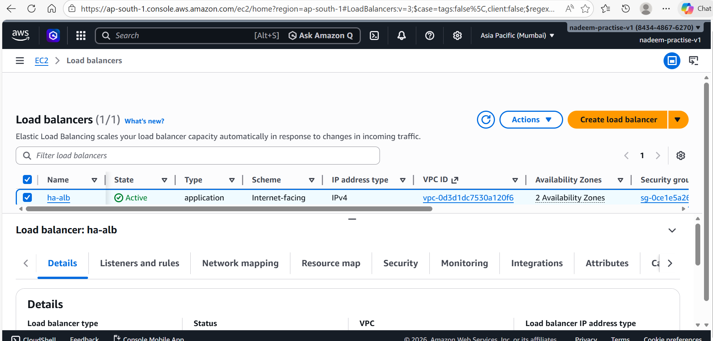
    </td>
  </tr>
  <tr>
    <td align="center">
      <b>📋 Launch Template</b><br/><br/>
      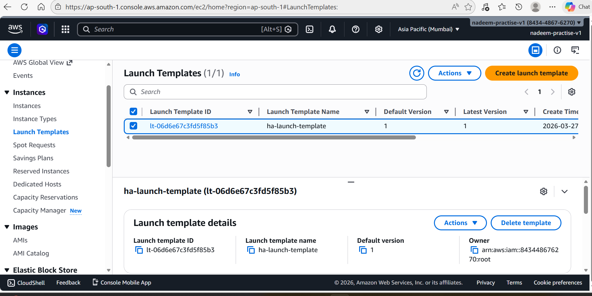
    </td>
  </tr>
  <tr>
    <td align="center">
      <b>📈 Auto Scaling Group (2 instances across AZs)</b><br/><br/>
      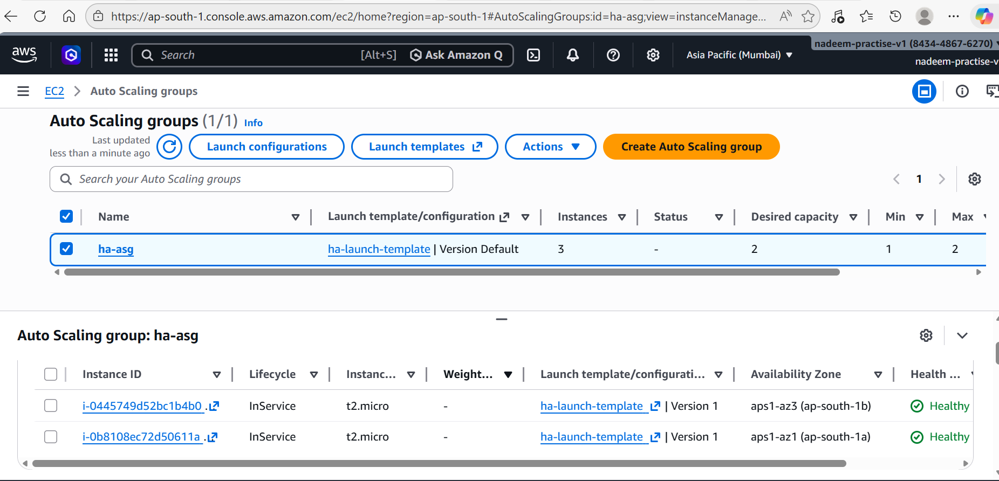
    </td>
  </tr>
   <tr>
    <td align="center">
      <b>🗄️ NAT Gateway</b><br/><br/>
      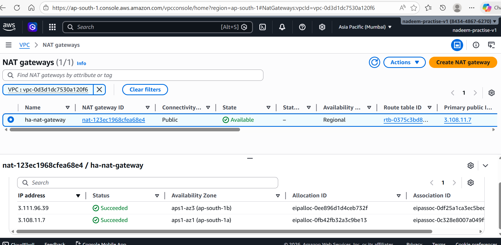
    </td>
  </tr>
  <tr>
    <td align="center">
      <b>🗄️ RDS Database</b><br/><br/>
      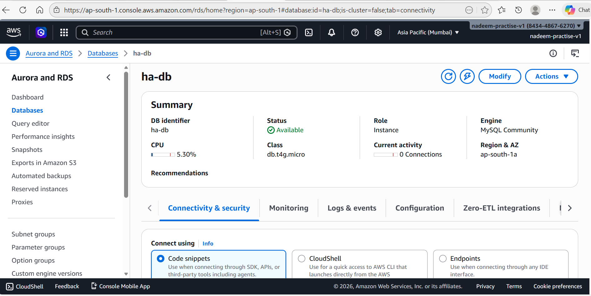
    </td>
  </tr>
  <tr>
    <td align="center">
      <b>📊 CloudWatch Alarm</b><br/><br/>
      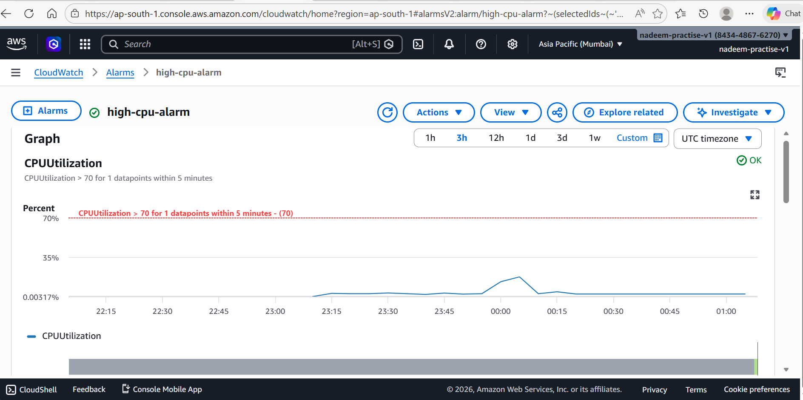
    </td>
  </tr>
  <tr>
    <td align="center">
      <b>🌐 Outputs & Execution Results </b><br/><br/>
      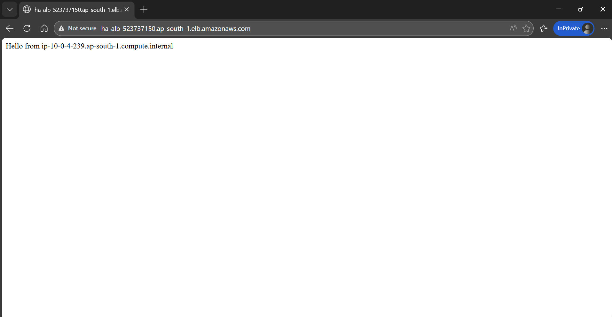
    </td>
  </tr>
  <tr>
    <td align="center">
      <b>🔄 Outputs & Execution Results </b><br/><br/>
      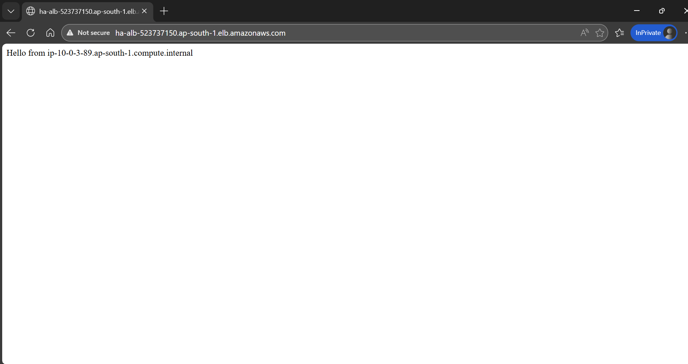
    </td>
  </tr>
</table>
---

## 🔥 How This Handles Scale

| Traffic Level | How System Responds |
|---|---|
| **100 users** | 1-2 EC2 instances handle load via ALB |
| **10,000 users** | ASG scales up to 2+ instances automatically |
| **100,000 users** | Add CloudFront CDN + ElastiCache |
| **1,000,000 users** | Multi-region + RDS read replicas + SQS queues |

---

## 💡 Key Design Decisions

**Why private subnet for EC2?**
> Prevents direct internet exposure. Only ALB can send traffic to EC2, reducing attack surface.

**Why 2 Availability Zones?**
> If one AWS data center goes down, the other AZ continues serving traffic — zero downtime.

**Why Bastion Host?**
> Secure, controlled SSH access to private instances without exposing them to the internet.

**Why NAT Gateway?**
> Allows private EC2 instances to download packages and updates without being publicly accessible.

**Why Auto Scaling Group?**
> Automatically replaces failed instances and scales capacity based on real traffic demand.

---


## 👨‍💻 Author

**Abdul Nadeem**
- AWS Solutions Architect Associate in Training
- Building production-grade cloud architectures
- Region: Asia Pacific (Mumbai) — ap-south-1

---

## 📚 What I Learned

- Designing **multi-layer security** with security groups
- Building **highly available** systems across multiple AZs
- Configuring **auto scaling** with launch templates and user data
- Setting up **load balancing** with health checks
- Managing **private networking** with NAT Gateway and route tables
- Monitoring infrastructure with **CloudWatch alarms**

---

> ⭐ If you found this helpful, please star the repository!
